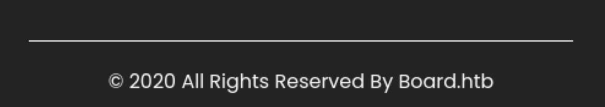

# BoardLight

### Recon

- open ports:
    - 80/http
    - 22/ssh
- OS: Linux
- found board.htb mentioned on the website

- added board.htb to /etc/hosts
- checking for virtual interfaces: fuzz the board.htb ⇒ crm stands out with the size and count of words

- add crm.board.htb to /etc/hosts
- after opening crm.board.htb there is website with Dolibarr
- tryingcredentials admin:admin worked, I’m in!

- using this exploit https://github.com/nikn0laty/Exploit-for-Dolibarr-17.0.0-CVE-2023-30253
    - simple explanation: <?php …> is disabled, using upperccase letters as <?PHP/pHp …> works

### Privilege escalation

- found configuration file at this location /var/www/html/crm.board.htb/htdocs/conf/conf.php

- user larissa and her password ⇒ larissa:serverfun2$2023!!
- ssh to larissa ⇒ user.txt

### Root shell

- linpeas.sh

- SUID exploit in enlightment app
    - https://github.com/MaherAzzouzi/CVE-2022-37706-LPE-exploit
    - https://github.com/ECU-10525611-Xander/CVE-2022-37706/blob/main/exploit.sh

