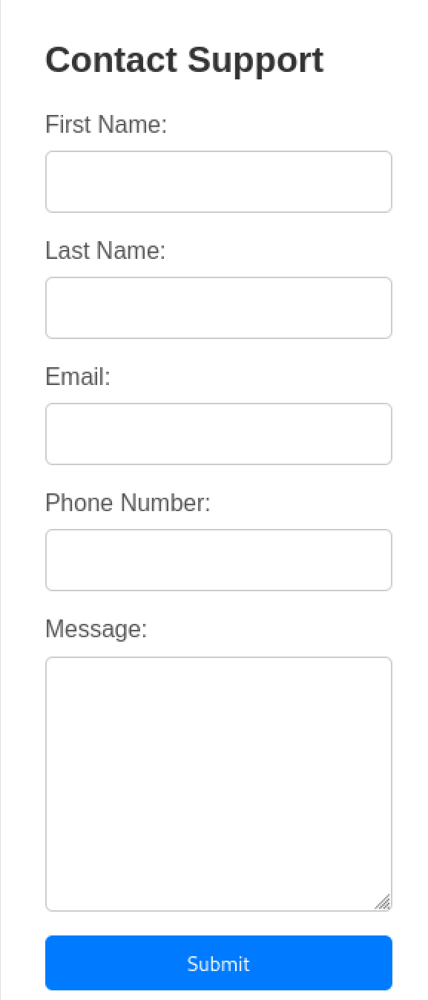
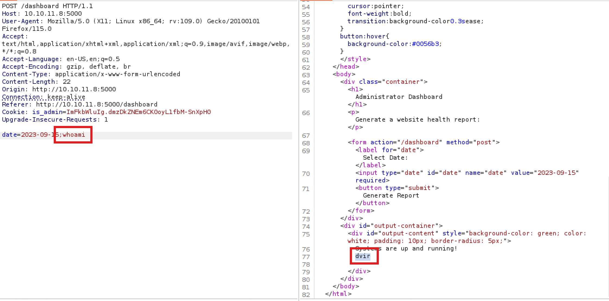

# Headless

### Recon

- open ports:
    - ssh\22 - OpenSSH 9.2p1 Debian 2+deb12u2
    - http\5000
    - OS: Linux

There is a form on /support

and forbidden page on /dashboard (I used gobuster to find it)

**admin cookie header**

I noticed cookie header is_admin, the first part is base64 encoded word “user”, I tried changing to admin, but to no avail, haven’t been able to crack the second part

**XSS**

I tried some XSS scripts and checking for SSTI, the sites behaves normally every time except when the payload is inserted into the message box. Then the site reflects user’s request

I tried changing the host header in my request to ``, I used <> because these characters fire up the reflection

XSS!!!!

**Stealing admin cookie**

Inserting ``

Setting up a listener, connection comes through, getting the admin cookie

**Getting shell (command injection)**

I copied the stolen cookie into the is_admin paramater and got admin access

after catching the request for generating report, I saw the weird date paramater on the bottom

I put a semicolon after the date and tried whoami and it worked!

creating a reverse shell payload, setting up listener for downloading the shell and netcat listener for the reverse shell itself

sending curl piped to bash

and I got a shell as user 

I stabilise the shell with stty/script trick

### Getting root

user dvir can run /usr/bin/syscheck

there is vulnerability syscheck program doesn’t specify the whole path to [intidb.sh](http://intidb.sh) when executing it, so I can create my own intidb.sh in the directory I am now and get the root through it

I set up a listener netcat and after running syscheck I got the root shell!!

